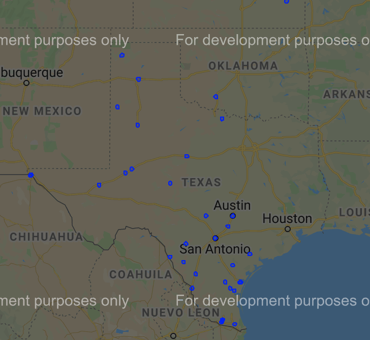
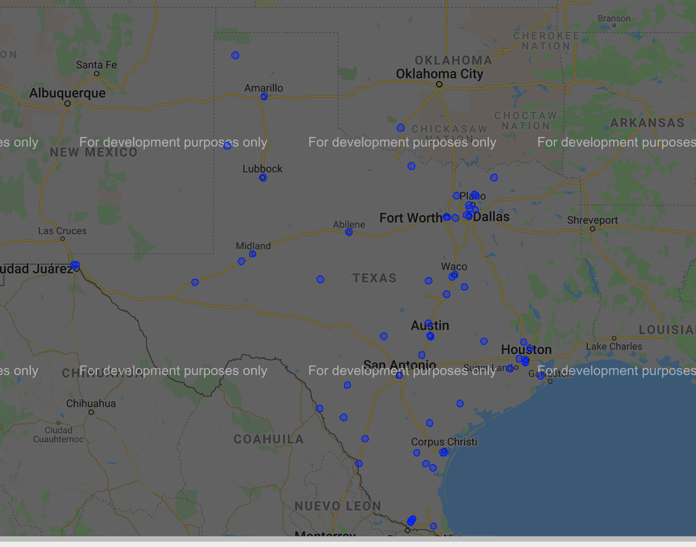
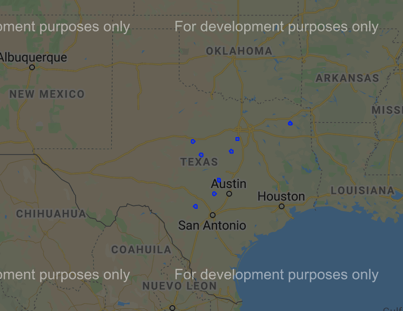
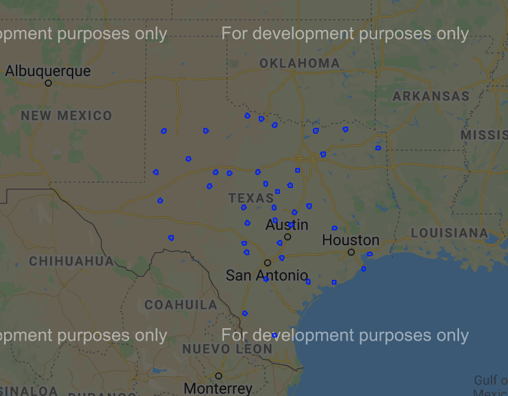
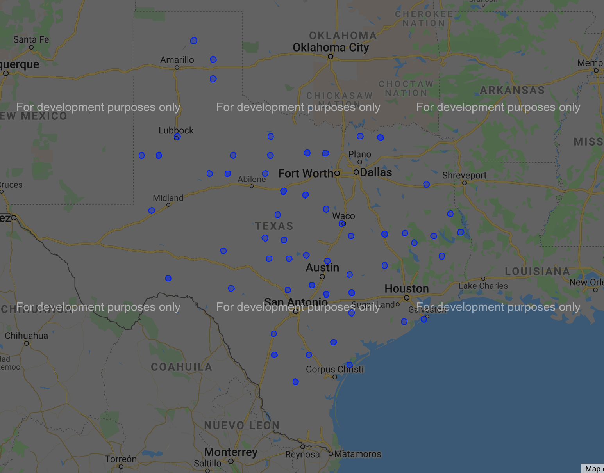

# Optimizing COVID-19 Vaccine Distribution Using Quantum Annealing

Abstract
---
Quantum annealing hardware has demonstrated the potential to solve discrete optimization problems by using qubits to model physical energy states. Using DWave’s annealing technology, we aim to gain solve problems relating to vaccine distribution. The goal of our project was to maximize the number of people vaccinated in the shortest possible time by reducing the distance they traveled. 

Motivation
---
The rate of COVID-19 vaccinmation is significantly slower than initially predicted by government officials. This may be due to a combination of factors such as delays in shipments to distribution centers, long travel distances for patients, long wait times for the vaccine, and leftover vaccinations expiring. A lack of a government plan for vaccine distribution has the potential to increase the number of deaths in the US and also weaken the already strained healthcare system via more hospitalizations. Currently, COVID-19 vaccine distribution is in its early phases, providing doses to those over the age of 65 and to essential healthcare workers. As the vaccine becomes more readily available to the public, states face large logistical issues of where to add additional sites to handle the necessary demand. An overflow of sites leads to costs for special storage equipmemt, healthcare workers to administer vaccines, and incur transportation costs to transport the vaccines to the sites themselves. On the contrary, a shortage of sites leads to large wait times and slow rollout of the vaccine. We aim to frame this as an optimization problem to determine the effect of number of vaccine distribution sites on the average distance individuals have to travel to receive a vaccine using D-Wave's binary quantum model (BQM) solver. 

Summary
---
Our project focuses specifically on Texas and the population of age 65+ citizens at a county level, but this approach can be adapted to reflect national level distribution of vaccines for the general public (see more below). Texas offered a favorabe case study with its mix of urban and rural centers. Its public health data was also readily available online. Our optimization problem takes into account the following factors

* number of at-risk population of a county
* the number of existing distribution centers
* the desired number of new distribution centers 

Our project focuses specifically on Texas and the population of age 65+ citizens grouped by county, but this approach can be adapted to reflect national level distribution of vaccines for the general public (see more below). Please see the bottom of this page for a link to our sources.

Our algorithm was based on Victoria Goliber's [Placement of Charging Stations](https://github.com/dwave-examples/ev-charger-placement). We used the following constraints: 

1) Minimizing the average distance from counties to distribution centers
We defined the average distance between individuals and a distribution center as   

  

where *P* is the set of all counties and *D* is the set of all distances between each county and the distribution site.

Thus our constraint couble be seen as  

  

where *E* is the set of all distribution centers and *d_i,j* is the distance between distribution center *j* and county *i*.

2) Maximizing the distance between distribution centers
We would like the distribution centers to be spaced throughout the state. We did this by maximizing the distance 
as such:  

3) Only placing *|E|* distribution sites.

We modeled the counties of Texas a graph *G*, where each county represented a node *c_i* and each distribution center was another node *v_i*. We found a list of existing distribution centers in Texas [here](https://tdem.maps.arcgis.com/apps/webappviewer/index.html?id=3700a84845c5470cb0dc3ddace5c376b). Edges between nodes *(c_i, v_i)* were weighted using the [great circle distance](https://en.wikipedia.org/wiki/Great-circle_distance) as locations were all found in latitude-longitude coordinates.

Results
--
A visualization of our results our shown below.

10 sites:  
  

40 sites:  
  

70 sites:
  

We see that with only 10 sites, the locations are concentrated at the borders of Texas, avoiding the large population centers. As we increase the number of sites, more sites are placed in the center of the state, closer to large population clusters.

Limitations
--
Some limitations of this project include the assumptions that

* individuals will have access to transportation
* distribution centers have unlimited vaccine capacity
* populations are concentrated at the geographical center of the counties
* vaccines will be shipped directly to distribution centers
* all counties are weighted equally

We do not take into account dosage timings nor the capacity of each distribution center. However, this project can be seen as a proof-of-concept and more accurate models can be built off of these results.

Variation: Weighting Edges by Population and Distance
--
We reweighted edges between *(v_i, c_i)* as a product of population and distance. We also removed constraint 2, the maximizaition of distances from other distribution centers. We believed this would favor urban centers that contained more people. Thus, for example, a city with 500,000+ people could host 5 distribution centers.

Our results are shown here:

10 sites:  
  

40 sites:  
  

70 sites:
  

As predicted, the results favor the larger population clusters within the state of Texas. As the number of sites increase, the sites are increasingly placed in the rural areas closer to the state's borders.

Future Work
---
We believe that a better model of this problem would seek to minimize the distance between a county and its closest vaccine distribution center. We also would recommend iterating this process at a smaller scale, like zip code, to better serve local communities. We defined at-risk populations as only those over the age of 65 but we can expand that definition and include individuals with a history of chronic and respiratory diseases.

iQuHACK 2020 Team 1206
---
Mindy Long  
Shreya Karpoor  
Elaine Pham  
